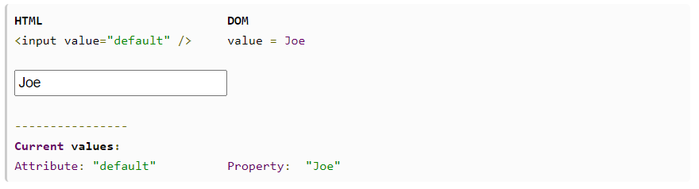

# 2021.02.08 HTML Property와 Attribute 차이점

DOM에 대해 공부하면서, DOM 인터페이스와 속성(attribute), 메서드에 대해 알게 되었습니다.
그런데 개발자 도구에서 DOM 객체가 구현한 DOM 인터페이스와 그 속성, 메서드는 elements - properties에서 확인가능한 것을 볼 수 있습니다. 그러면 HTML에서 `프로퍼티 property`란 무엇이고  `속성 attribute`이란 무엇일까요? 구글링을 해봐도 어딘가 찜찜한 대답만을 얻을 수 있었기 때문에, 직접 탐구해보기로 하였습니다.

이 두 가지 개념의 차이를 이해하고, 개발과정에서 개념과 용어를 명확히 사용하는 데 도움이 되고자 합니다.


### TL; DR

- `속성`은 HTML 요소의 동작과 표현을 설정하기 위한 옵션
- `프로퍼티`는 DOM에 표현된 HTML 요소 **객체**의 프로퍼티
- 매칭되는 `속성`과 `프로퍼티`는 대부분 자동으로 동기화
- DOM 인터페이스의 속성은 DOM의 HTML 객체가 `프로퍼티`로 가지고 있음
- `속성`은 초기값만을 가지고 있으며 변하지 않는다는 글은 잘못된 정보


### 1. 속성 Attribute

- [MDN의 HTML 특성 참고서](https://developer.mozilla.org/ko/docs/Web/HTML/Attributes)를 보면, HTML 요소에서 사용할 수 있는 `속성`의 전체 목록을 볼 수 있습니다.

  > MDN에서는 특성이라고 번역하고 있으나, 특성보다는 속성이라는 표현이 더욱 일반적으로 사용되는 것 같아 여기에서는 속성이라고 번역하고 있습니다.

-  `속성`은 아래와 같이 HTML 요소의 표현과 동작을 설정하기 위해 사용되는 **표준 옵션**입니다.

  ``` html
  <!-- input 요소에 type, value 속성에 각각 "number", 0 이라는 값을 할당했습니다. -->
  <!-- number 타입이므로, 이 input 요소에는 숫자 외의 문자열은 입력할 수 없습니다. -->
  <input type="number" value="0" />
  ```

- 이렇게 설정된 `속성`은 자바스크립트에서 접근해 확인할 수 있습니다.

  ``` js
  const input = document.querySelector('input');
  console.log(input.attributes);
  // {0: type, 1: value }
  // 실제로는 NamedNodeMap이지만 간략하게 표현하였습니다.
  
  console.log(input.getAttribute('type')); // "number"
  ```

- 또는 자바스크립트에서 `속성`을 지정할 수도 있습니다.

  ``` js
  input.setAttribute('class', 'my-input');
  input.getAttribute('class'); // "my-input"
  ```

- 아무 속성(비표준 속성)이나 지정할 수도 있지만, 요소의 표현과 동작에는 영향을 미치지 않습니다.

  ``` js
  input.setAttribute('my-attribute', 'oops');
  input.getAttribute('my-attribute'); // "oops"
  ```

- HTML에서도 마찬가지로 비표준 속성을 지정할 수 있습니다.

  ``` html
  <input type="text" my-attribute="oops" />
  ```

  

### 2. 프로퍼티 Property

- `프로퍼티`는 객체가 담고 있는 키-값 쌍을 갖는 요소를 의미하는 용어입니다.

- **HTML요소는 DOM에서 객체로 표현**되므로, `프로퍼티`는 이 객체가 가지고 있는 `프로퍼티`를 의미합니다.

- 따라서 점 표기법(dot notation) 또는 대괄호 표기법(square bracket notation)을 이용해 접근, 수정할 수 있습니다.

  ``` js
  console.log(input.type); // "number"
  input.type = "text";
  console.log(input['type']); // "text"
  ```

- 임의의 `프로퍼티`를 할당하는 것도 가능합니다.

  ``` js
  input.myProp = "yeah";
  console.log(input.myProp); // "yeah"
  ```

- DOM 인터페이스에 정의된 속성과 메서드도 마찬가지로 점 표기법으로 접근하고 사용할 수 있습니다.

- 따라서 DOM 인터페이스의 속성과 메서드는 HTML 요소 객체의 `프로퍼티`가 되는 것을 알 수 있습니다.

  ``` js
  // 예를 들어 EventTarget 인터페이스의 addEventListener() 메서드에 접근하여 사용할 수 있습니다.
  input.addEventListener('click', () => alert('clicked'));
  
  // Element 인터페이스의 getAttribute() 메서드를 이용해 특정 속성의 값을 확인할 수도 있습니다.
  console.log(input.getAttribute('type')); // "text"
  ```


### 3. 동기화

- 매칭되는 `속성`과 `프로퍼티`는 예외적인 경우를 제외하고 하나의 값이 변할 때 다른 하나의 값도 변경됩니다.

  ``` js
  // 요소의 클래스명은 프로퍼티에서 className으로, 속성에서 class라는 이름을 사용합니다.
  
  input.className = 'my-input';
  console.log(input.className);             // "my-input"
  console.log(input.getAttribute('class')); // "my-input"
  ```

- `속성`과 매칭되지 않는 `프로퍼티`는 자동으로 변경되지 않습니다.

  ``` js
  // 비표준 속성을 설정하고 같은 이름의 프로퍼티가 존재하는지 확인합니다.
  input.setAttribute('my-attribute', 'oops');
  console.log(input['my-attribute']); // undefined
  ```

- `속성`은 항상 문자열 값을 갖지만, `프로퍼티`의 값은 모든 자료형이 될 수 있습니다.

  ``` html
  <input type="checkbox" checked />
  
  <script>
  	const input = document.querySelector('input');
      console.log(input.checked)                 // true
      console.log(input.getAttribute('checked')) // ''
  </script>
  ```


### 4. 잘못된 정보

- HTML `속성`과 `프로퍼티`의 차이를 설명하는 대부분의 한국어 자료는 [이 문서](http://jquery-howto.blogspot.com/2011/06/html-difference-between-attribute-and.html)를 번역한 자료입니다.

- 결론으로 `속성`은 정적이며 결코 변하지 않고, `프로퍼티`만이 동적이며 변화한다고 설명하고 있습니다.

- 예시로 다음과 같은 사진을 보여주고 있습니다.

  

- 실제로 코드를 작성해보면 `value 속성` 값이 변하지 않는 것을 볼 수 있습니다.

  ``` js
  console.log(input.value);                // Joe
  console.log(input.getAttribute('value')) // default
  ```

- 이는 예외적인 상황으로, input 태그에 값을 입력하는 것이  `value 속성`의 값을 바로 바꿔주지 않는 경우입니다.

- 위의 동기화 부분에서 볼 수 있듯이 `className 프로퍼티`를 변경하면 `class 속성` 또한 변경되며,
  다른 매칭되는 `프로퍼티`와 `속성` 또한 마찬가지입니다.

---

### 참고자료

- [MDN - HTML 특성 참고서](https://developer.mozilla.org/ko/docs/Web/HTML/Attributes)
- [모던 자바스크립트 튜토리얼 - 속성과 프로퍼티](https://ko.javascript.info/dom-attributes-and-properties)