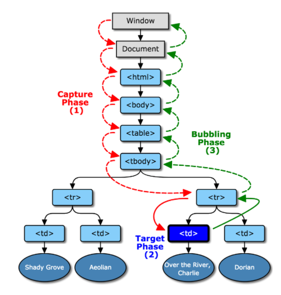
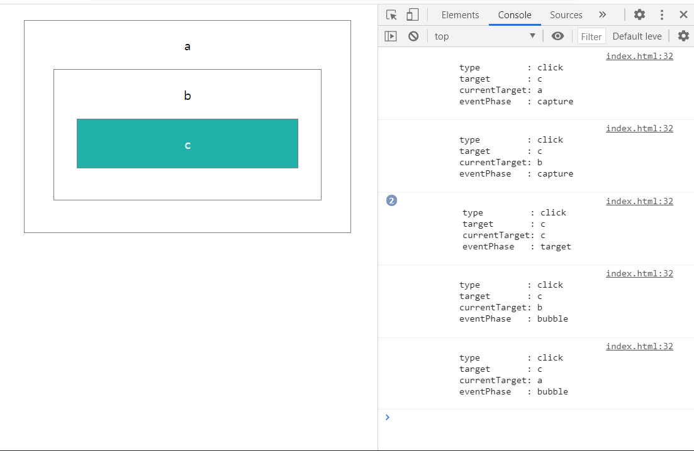
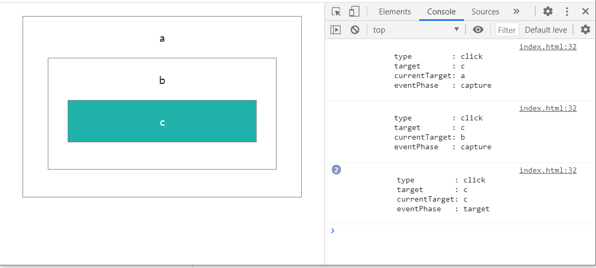
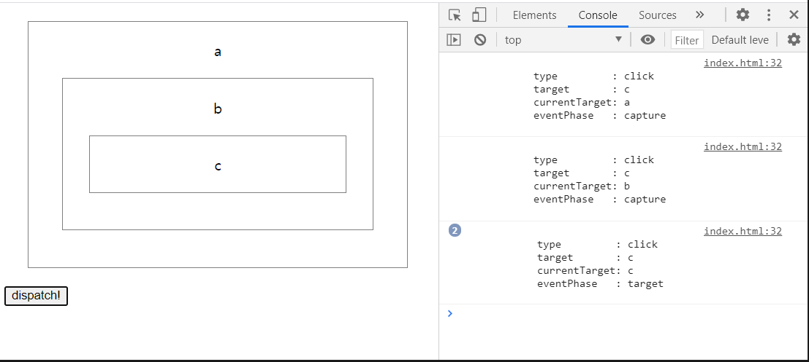

# 2021.02.09 Event

이전 글에서 자바스크립트가 DOM을 이용해 요소에 접근하고 조작하는 방법에 대해 공부했습니다. 이러한 조작은 스크립트에 작성한 순서대로, 즉 절차적으로 작동시킬 수도 있지만 자바스크립트의 원래 목적인 사용자와 상호작용하는 동적인 웹 구현에 적절한 방식은 아닙니다. 자바스크립트는 정해진 순서 없이 다양한 방식으로 들어오는 사용자 입력에 반응하여 동작을 수행하기 위해서 이벤트 기반 방식으로 작동합니다.

이벤트 기반 프로그래밍과 자바스크립트의 이벤트에 대해 이해하고, 이벤트를 적절하게 다루는 것을 목표로 합니다.


### TL; DR

- 이벤트는 DOM 내부에서 전파되는 객체로, `Event` 인터페이스를 구현
- 이벤트 전파는 `캡처`·`타겟`·`버블` 의 3가지 단계가 있음
- DOM 요소는 이벤트 리스너를 등록해 전파되는 이벤트를 포착하고 반응할 수 있음


### 1. 이벤트 기반이란?

- 이벤트란 프로그램에 의해 감지되고 처리되 수 있는 동작이나 사건입니다.
- `이벤트 기반`이란 이벤트를 감지·반응하여 프로그램을 실행시키는 프로그래밍 방식 또는 아키텍처를 의미합니다. `발행-구독` 패턴을 기반으로 구현됩니다.
- 자바스크립트는 사용자 입력의 복잡성에 대응하기 위해 이벤트 기반 프로그래밍 모델을 사용합니다.


### 2. 자바스크립트에서의 이벤트

- 웹 브라우저 환경의 자바스크립트에서 이벤트는 DOM 내부의 객체입니다.

  > 이벤트 기반 프로그래밍은 자바스크립트만의 것이 아니며, 자바스크립트의 이벤트는 환경에 따라 다른 방식으로 동작합니다. 여기에서는 웹 브라우저 환경에서의 자바스크립트만을 다루고 있습니다.

- 모든 이벤트 객체는 Web API의 `Event` 인터페이스를 구현합니다.

- 일부 이벤트는 `Event` 인터페이스의 파생 인터페이스를 구현합니다.

  > `Event` 인터페이스의 속성·메서드 및 파생 인터페이스는 [MDN - Event](https://developer.mozilla.org/ko/docs/Web/API/Event)에서 확인할 수 있습니다.
  >
  > 자바스크립트에서 사용할 수 있는 이벤트 목록은 [MDN - Event Reference](https://developer.mozilla.org/en-US/docs/Web/Events) 에서 확인할 수 있습니다.

- 이벤트 객체는 전파되면서 이벤트 리스너의 핸들러 함수에 파라미터로 전달됩니다.
  보통 `e` 라는 이름을 사용합니다.

  

### 3. 이벤트 객체 생성

- 이벤트 객체는 약속된 사용자 행동이나 상황에서 발생하지만, [Event() 생성자](https://developer.mozilla.org/ko/docs/Web/API/Event/Event)나 [CustomEvent() 생성자](https://developer.mozilla.org/ko/docs/Web/API/CustomEvent/CustomEvent)를 이용해 만들어낼 수도 있습니다.


### 4. 이벤트 전파

- DOM에서 발생한 이벤트는 `window` 객체에서 출발해 3가지의 단계(phase)를 거칩니다.

  ​	1) `캡처 단계 (Capture phase)` : 전파 경로(propagation path)를 따라 타겟 요소의 부모까지 전파되는 단계

  ​	2) `타겟 단계 (Target phase)`   : 이벤트의 타겟에 도착한 단계

  ​	3) `버블 단계 (Bubble phase)`  :  전파 경로를 따라 다시 `window` 객체까지 되돌아가는 단계

- [W3C의 DOM Level 3 표준](https://www.w3.org/TR/DOM-Level-3-Events/#event-flow)에서 이벤트 전파를 설명하는 이미지를 보면 쉽게 이해할 수 있습니다.




### 5. 이벤트 리스너 등록

- DOM 요소가 전파되는 이벤트를 감지하고 반응하기 위해서는 이벤트 리스너를 등록해야 합니다.

- DOM의 모든 요소 객체는  `EventTarget` 인터페이스를 구현하고 있습니다.

- `EventTarget`의 `addEventListener()` 메서드를 이용해 이벤트 리스너를 등록할 수 있습니다.

  ``` js
  function onClickTarget(e) {
      console.log(e.target.innerText);
  }
  div.addEventListener('click', onClickTarget);
  div.reomveEventListener('click', onClick)
  ```
  
- 다른 DOM 인터페이스에서 제공하는 `onclick`, `onfocus` 등의  `onevent` 속성이나 HTML 속성(attribute)을 통해 이벤트 핸들러를 등록할 수도 있습니다.

- HTML 속성을 이용할 때에는 항상 마크업보다 핸들러가 먼저 선언되어있어야 하고, 마크업이 복잡해지며 전역변수가 오염된다는 단점이 있습니다.

  ``` html
  <script>
      const clickHandler = () => console.log('clicked');
  </script>
  
  <button onclick="clickHandler()">click here</button>
  
  <script>
  	const button = document.querySelector('button');
      button.onclick = () => {
          alert('onclick handler changed');
      };
  </script>
  ```

-  `addEventListener()`는 여러 개의 이벤트 핸들러를 등록할 수 있고, `useCapture`와 `options` 파라미터를 이용해 상황에 맞게 핸들러 특성을 지정할 수 있으므로 `onevent`보다는 `addEventListener()`가 권장됩니다.


### 6. 실습

- 3개의 div 태그를 중첩하고 가장 안에 있는 `c` 를 클릭했을 때, 캡처링 및 버블링 되는 과정을 콘솔에 출력하도록 하였습니다.

  ``` html
  <!-- index.html  -->
  <div id="a">
      a
      <div id="b">
          b
          <div id="c">c</div>
      </div>
  </div>
  
  <script>
      const logEventInfo = e => {
          const eventPhaseName = { 1: 'capture', 2: 'target', 3: 'bubble', };
          console.log(`
            type         : ${e.type}
            target       : ${e.target.id}
            currentTarget: ${e.currentTarget.id}
            eventPhase   : ${eventPhaseName[e.eventPhase]}
          `);
      };
  
  	document.querySelectorAll('div').forEach(item => {
          // useCapture를 true로 설정하여 캡처링 단계에서 이벤트를 포착합니다.
          item.addEventListener('click', logEventInfo, true);
          // useCapture를 기본값 = false로 설정하여 버블링 단계에서 이벤트를 포착합니다.
          item.addEventListener('click', logEventInfo);
      });
  </script>
  ```

- 해당 html 파일을 열고 `c`를  클릭하면 다음과 같이 출력됩니다.

- 각 요소에는 이벤트 리스너가 2개씩 등록되어 있지만, 각각 `캡처` 단계와 `버블` 단계에서 호출되는 것을 볼 수 있습니다.

  

- `Event.stopPropagation()`을 사용해 전파를 멈출 수 있습니다.

  ``` js
  const logEventInfo = e => {
      // ...
      // 타겟에 도달하면 전파를 멈추게 합니다.
      if (e.eventPhase === 1) e.stopPropagation();
  };
  ```

- `c` 에도 두 개의 이벤트 리스너가 등록되어있기 때문에 두 번 출력되지만, 버블링 단계는 진행되지 않습니다.



- `EventTarget.dispatchEvent()` 메서드를 사용하면 특정 노드에서 바로 이벤트를 발생시킬 수도 있습니다.

- 버튼을 클릭하면 `c` 요소에서 `click` 타입의 이벤트가 발생하도록 하였습니다.

  ```  js
  const c = document.querySelector('#c');
  const button = document.createElement('button');
  button.innerText = 'dispatch!';
  button.addEventListener('click', () => {
      c.dispatchEvent(new Event('click'));
  });
  document.body.appendChild(button);
  ```

- 노드에서 바로 `dispatchEvent()`를 사용해도 캡처링 단계는 진행됩니다.

  


### 5. 이벤트 위임 Event Delegation


---

### 참고자료

- [flaviscopes - JavaScript Event Explained](https://flaviocopes.com/javascript-events/)
- [rinae.dev - [번역] 초보 프론트엔드 개발자들을 위한 pub-sub 패턴 알아보기](https://rinae.dev/posts/why-every-beginner-front-end-developer-should-know-publish-subscribe-pattern-kr)