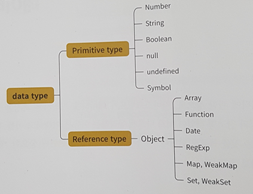
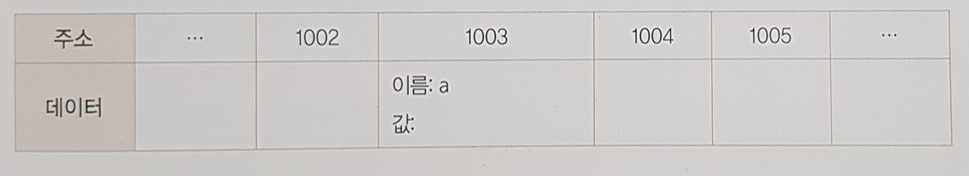
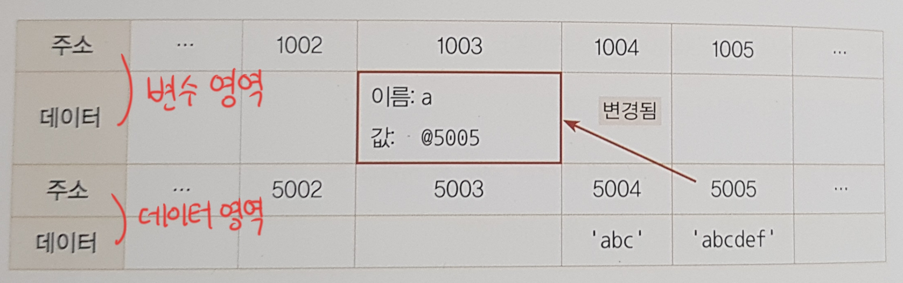
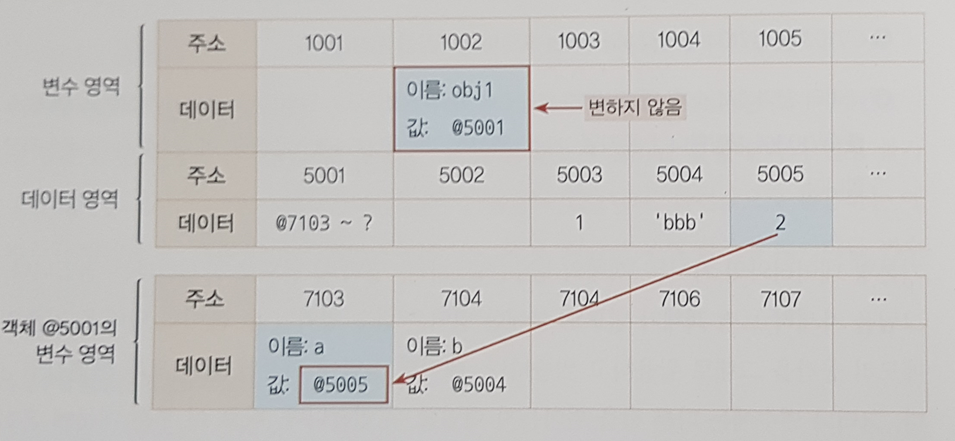
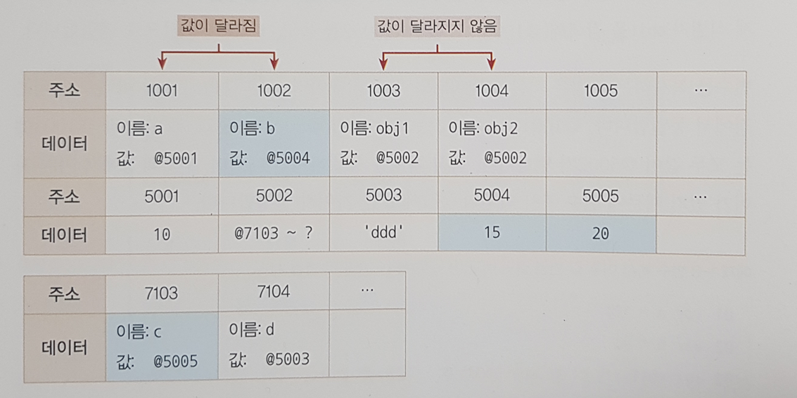
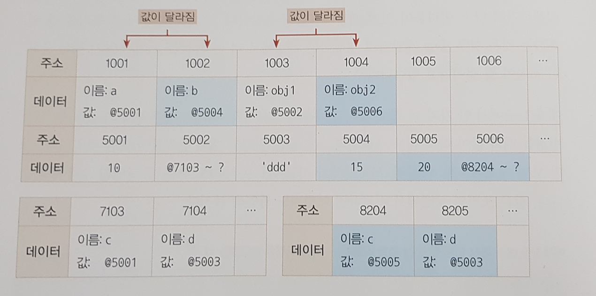

# Chapter 1: 데이터 타입


### 1. 데이터 타입의 종류



- #### 기본형(primitive)

  - number, string, boolean, null, undefined, symbol
  - 불변성을 띕니다  => `3. 변수 선언과 데이터 할당` 에서 추가 설명

- #### 참조형(reference)

  - object가 존재 합니다
  - object의 하위 분류로서 Array, Function, Date, RegExp(정규표현식), Map, WeakMap, Set, WeakSet 등이 존재 합니다.
  - primitive와 달리 가변값인 경우가 많지만 설정에 따라 변경 불가능한 경우도 있습니다.


### 2. 식별자(identifier)와 변수(variable)

> 변수 === 데이터, 식별자 === 변수명

- 변수(variable) : **`변할 수 있는 무언가(데이터)`**

  수학 용어를 차용했기 때문에 '수'가 붙어 있을 뿐, 컴퓨터 용어로 사용 쓸 때는 `변할 수 있는 무언가` 라는 뜻으로 사용합니다. 여기서 무언가는 **`데이터`**를 말합니다.

- 식별자(identifier) : **`변수명`**

  어떤 데이터를 식별하는 데 사용하는 이름, 즉 **`변수명`** 입니다.


### 3. 변수 선언과 데이터 할당

- #### 변수 선언

  

  ```javascript
  let a; // 변수를 선언하면 위의 그림처럼 변수 영역에 변수명을 가진 공간을 확보합니다.
  ```


- #### 데이터 할당

  

  ```javascript
  let a;  // 변수를 선언하는 과정
  a = 'abc';  // 데이터를 할당하는 과정 => 데이터 영역에 비어있는 공간을 확보후 'abc'를 할당
  // 변수 영역의 값은 @5004를 가지게 됩니다.
  // 이제 @5004에 할당된 'abc'의 경우 절대 변하지 않습니다.
  
  a = a + 'def' // @5004에 있는 데이터는 변경되지 않습니다.
  // 새로운 데이터 영역에 @5005에 'abcdef'를 할당하고 a는 @5005를 가리키게 됩니다.
  // 자신을 참조하는 변수가 없어진 @5004는 가비지 컬럭터의 수거대상이 됩니다.
  ```


- #### 데이터를 직접 할당하지 않고 주소를 값으로 가지는 이유

  - 같은 값을 가지게 되는 경우 메모리낭비가 발생하게 됩니다. 
    (ex, 변수 500개를 생성 후 모두 같은 값을 할당하는 경우)
  - 데이터마다 필요한 메모리 공간이 다르기 때문에 공간의 크기를 변경하는 작업이 필요하게 됩니다.

  

### 4. 기본형 데이터와 참조형 데이터

- #### 불변값과 상수는 다른 개념

  변수 영역에서의 변경이 가능여부가 변수와 상수를 결정합니다.

  데이터 영역에서의 변경가능 여부가 불변성, 가변성을 결정합니다.


- #### 불변값

  데이터 영역에 값에 한번 할당된 경우 데이터가 변하지 않습니다. => 불변값

  ```javascript
  let a = 'abc';
  a = a + 'def'; // a가 가리키는 주소가 변경됩니다 => 변수
  ```


- #### 가변값

  

  ```javascript
  let obj1 = {
      a: 1,
      b: 'bbb'
  };
  // obj1이 선언되며 @1002에 변수명과 주소가 저장합니다.
  // @5001에 내부 프로퍼티들의 주소를 저장하기 위한 별도의 변수 영역을 마련하고 주소를 저장합니다. 
  // -> 필요한 시점에 동적으로 할당합니다.
  // @7103, @7014에 각각의 프로퍼티들의 이름을 지정 데이터 영역에서 1, 'bbb'를 탐색합니다.
  // 없는 경우 데이터를 생성하고 해당 주소를 저장합니다.
  
  
  obj1.a = 2;
  // 데이터 영역에 2가 없으므로 2를 @5005에 저장한후 @7103의 주소값을 @5005로 변경합니다.
  ```


- #### 변수 복사후 변경시 차이점

  ```javascript
  let a = 10;
  let b = a;
  let obj1 = {c: 10, d:'ddd'};
  let obj2 = obj1;
  
  b = 15;
  obj2.c = 20;
  ```

  
  - 변수 a, b는 서로 다른 주소를 보고 있지만 obj1, obj2는 여전히 같은 주소를 보고 있습니다.

    `a !== b`, `obj1 === obj2` 인 상황이 됩니다.

  

  ```javascript
  let a = 10;
  let b = a;
  let obj1 = {c: 10, d:'ddd'};
  let obj2 = obj1;
  
  b = 15;
  obj2 = {c: 20, d:'ddd'};
  ```

  

  - 객체 자체를 다시 할당하는 경우 obj2의 주소가 변경됩니다.
  - 즉, 참조형 데이터가 '가변값'이라고 하는 것은 내부의 프로퍼티를 변경할 때만 성립합니다.


### 5. 불변 객체

- 원본을 그대로 두고 사용할 객체를 깊은 복사를 통해 새로운 객체를 생성해야 합니다.

- JSON을 활용

  ```javascript
  let obj1 = {1:1, 2:2};
  
  // __proto__, getter/setter, methods들은 복사가 안됩니다.
  // 순수한 정보만을 다룰 때 활용하기 좋은 방법입니다.
  let obj2 = JSON.parse(JSON.stringify(obj1));
  
  ```


### 6. undefined & null

- undefined
  - 사용자가 명시적으로 지정할 수도 있지만 값이 존재하지 않을 때 자바스크립트 엔진이 자동으로 부여
    1. 값을 대입하지 않은 변수에 접근할 때
    2. 객체 내부의 존재하지 않는 프로퍼티에 접근하려고 할 때
    3. return 문이 없거나 호출되지 않는 함수의 실행 결과
- null
  - undefined와 마찬가지로 값이 비어있는 경우 사용
- undefined 와 null 모두 비어있음을 뜻하지만 undefined 는 자바스크립트내부의 엔진이 자동으로 부여하는 경우가 있습니다.
- 그러므로 비어있음을 명시적으로 나타내고 싶을때는 undefined를 지양하고 null을 사용합니다.