# Chapter 2: 실행 컨텍스트

### 1. 실행 컨텍스트란(excution context)?

> ##### 실행할 코드에 제공할 환경 정보들을 모아놓은 객체

- 실행 컨텍스트 구성 방법

  - 전역공간 : 자동으로 생성됩니다.

  - eval () 함수 :  악마 취급을 받습니다.
    ※ 반대 견해도 있습니다.

  - **`함수 실행`**

    |                             코드                             |                        실행 컨텍스트                         |
    | :----------------------------------------------------------: | :----------------------------------------------------------: |
    | 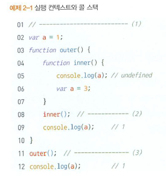 |  |

- 실행 컨텍스트에 담기는 정보들

  - VariableEnviroment
  - LexicalEnviroment
  - ThisBinding

  

- 실행 컨텍스트는 자바스크립트 엔진이 활용할 목적으로 생성할 뿐 개발자가 코드를 통해 확인할 수는 없습니다.

### 2. VariableEnviroment & LexicalEnviroment

> 현재 컨텍스트 내부에는 a, b, c와 같은 식별자들이 있고
> 그 외부 정보는 D를 참조하도록 구성돼 있다.

- VariableEnviroment

  > 현재 컨텍스트 내의 식별자들에 대한 정보 + 외부 환경 정보

  - 실행 컨텍스트를 생성할 때 VariableEnviroment에  정보를 먼저 담은 후 이를 그대로 복사해서 LexicalEnviroment를 만듭니다.
  - 최초의 스냅샷을 그대로 유지하며 변경사항은 반영되지 않습니다.
  - LexicalEnviroment를 만든 후에는 LexicalEnviroment를 주로 활용합니다.

  

- LexicalEnviroment

  - VariableEnviroment와 같지만 변경 사항이 실시간으로 반영됩니다.

  

- VariableEnviroment와 LexicalEnviroment 모두 enviromentRecord와 outerEnviromentReference로 구성돼 있습니다.

#### 2 - 1. 호이스팅

- 현재 컨텍스트와 관련된 코드의 식별자 정보들이 저장됩니다.

- 컨텍스트를 구성하는 함수에 지정된 매개변수 식별자, 선언한 함수의 경우 함수 자체, var로 선언된 변수의 식별자 등이 수집대상에 해당됩니다.
  ※ 함수 표현식으로 정의된 함수의 경우는 함수 전체가 호이스팅 되지 않고 변수명만 호이스팅 됩니다.
  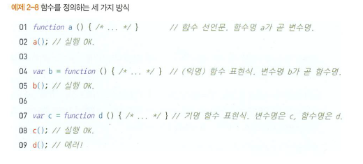

- 예시

  | 원본 코드                                                    | 호이스팅 후                                                  | 비고                                                         |
  | ------------------------------------------------------------ | ------------------------------------------------------------ | ------------------------------------------------------------ |
  | 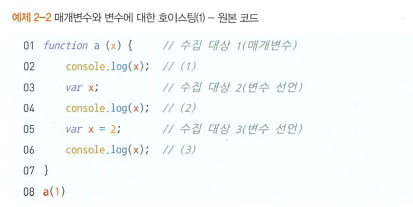 | 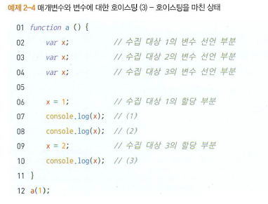 | 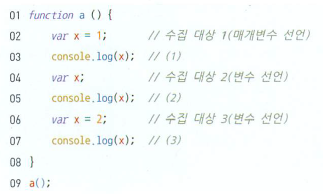 다음의 경우와 같다고 볼수 있습니다. 1, 1, 2 라는 결과가 출력 됩니다. |
  | 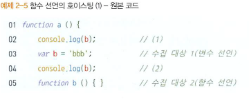 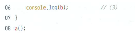 |  | 함수의 경우 함수 전체가 호이스팅됩니다.                      |
  | 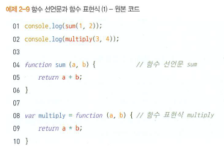 | 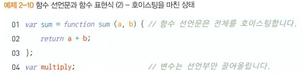 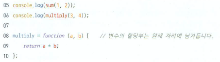 | 6번째 줄에서 multiply is not a function 이라는 메시지가 출력되며 종료 됩니다. |

  

#### 2 - 2. 스코프, 스코프 체인, outerEnviromentReference

- 스코프(scope)

  > 식별자에 대한 유효범위

  - 외부 스코프에서 선언한 변수는 내부 스코프에서 접근이 가능하지만 반대의 경우는 불가능 합니다.
  - ES5 까지는 함수에 의해서만 스코프가 생성되었지만 ES6 에서 블록에 의해서도 스코프 생성이 가능하며 구분을 위해 함수 스코프, 블록 스코프라는 용어를 사용합니다.

- 스코프 체인(scope chain)

  > 식별자의 유효범위를 안에서부터 바깥으로 차례로 검색해나가는 것

  - outerEnviromentReference는 현재 함수가 선언될 당시의 LexicalEnviroment를 참조합니다.
  - 가까운 요소부터 차례대로만 접근 가능하기 때문에 스코프 체인 상에서 가장 먼저 발견된 식별자에만 접근 가능합니다.

  |                           원본코드                           |                         스코프 체인                          |
  | :----------------------------------------------------------: | :----------------------------------------------------------: |
  | 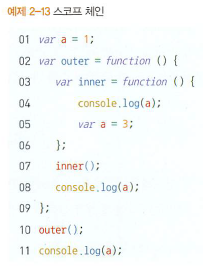 | 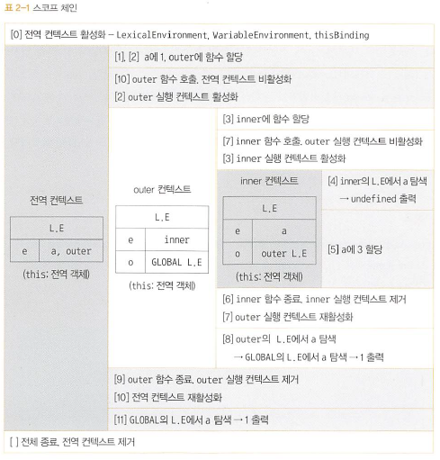 |

  ※ inner 함수 내부에서 a 변수를 선언했기 때문에 전역 공간에서 동일한 이름의 a 변수에는 접근할 수 없는데 이를 변수 은닉화(variable shadowing)라 합니다.