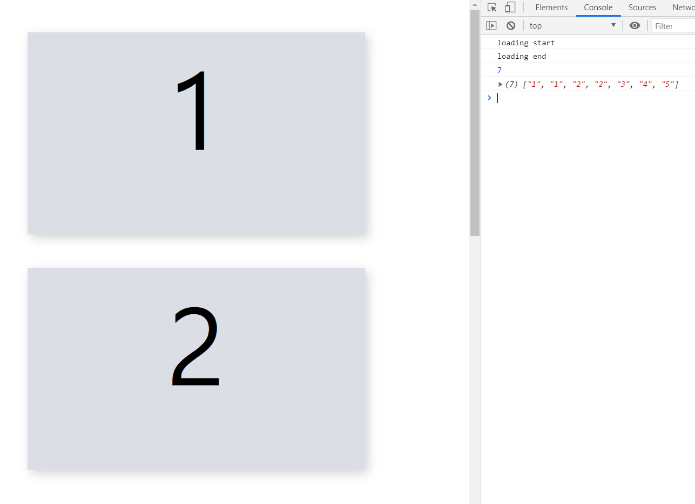
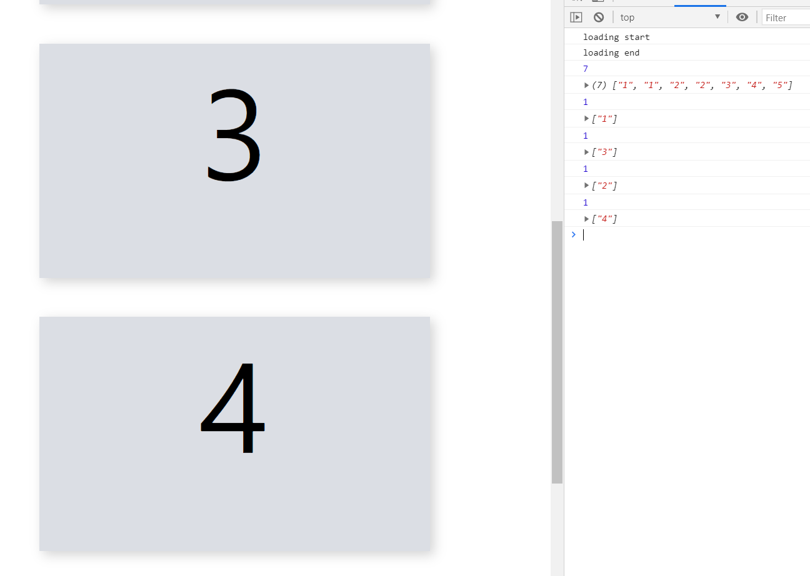
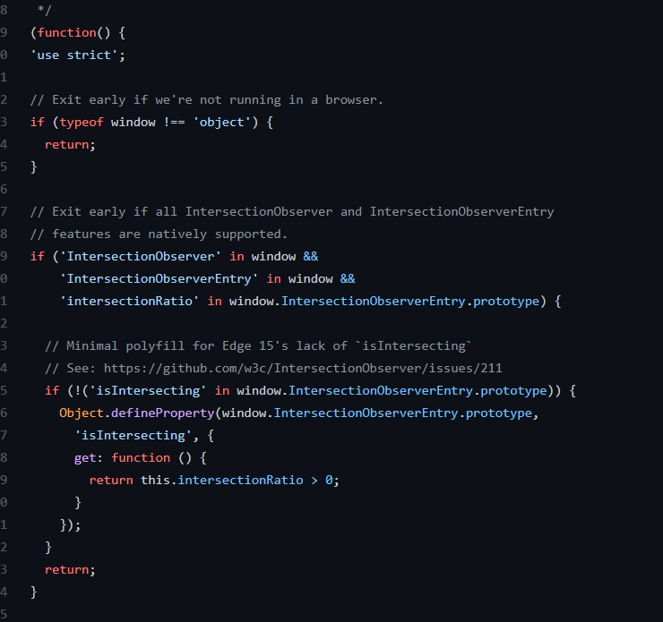

# 2021.02.19 IntersectionObserver API

### 목차

0. [IntersectionObserverAPI란?](###0.-IntersectionObserver-API란?)
1. [사용법](###1.-사용법)
2. [의문점](###2.-의문점)
3. [소스코드 뜯어보기](###3.-소스코드 뜯어보기)
4. 마무리

---


## 0. IntersectionObserver API란?

- 특정 요소가 화면에 표시되었는지 여부를 확인하는 데 사용하는 Web API 입니다.
- 조금 더 정확하게 표현하면, 타겟 요소와 상위 요소 또는 최상위 document 의 뷰포트 사이의 intersection 내의 변화를 비동기적으로 관찰하는 방법입니다.
- 이미지나 컨텐츠의 지연 로딩, infinite scroll 구현, 화면에 표시되지 않는 애니메이션의 수행 중지 등을 위해 사용할 수 있습니다.

- 기존에는 Scroll 이벤트의 핸들러에서 `Element.getBoundingClientRect()` 메서드를 이용해 요소의 뷰포트 상에서의 포지션 값을 받고 연산하는 방법을 사용하였습니다.
- 위의 방법은 Scroll 이벤트 발생 횟수가 굉장히 많기 때문에 여러 요소에서 사용하면 수많은 교차 탐지 로직이 메인스레드에서 동작하게 되기 때문에 성능을 저하시킬 수 있었고, 이를 개선하기 위해 도입된 것이 Intersection Observer API 입니다.
- Intersection Observer는 별도의 스레드에서 비동기적으로 작동하기 때문에 성능을 최적화할 수 있습니다.
- 두 요소(타겟 요소와 상위요소 또는 뷰포트)의 교차 비율(intersectionRatio)이 일정 수준(threshold) 이상일 때 실행할 콜백함수를 등록할 수 있습니다.


## 1. 사용법

- 콜백함수와 옵션을 작성하고, 생성자로 `IntersectionObserver` 인스턴스를 생성합니다.

- 콜백함수는 항상 `entries`, `observer` 인수를 전달받으며,  `entries`는 IntersectionObserverEntry 객체의 배열입니다.

- IntersectionObserverEntry 객체의 속성을 이용해 교차 여부를 확인하고 로직을 실행시킬 수 있습니다.

- 속성은 아래의 링크에서 자세히 확인할 수 있습니다.

  > [MDN - IntersectionObserverEntry](https://developer.mozilla.org/en-US/docs/Web/API/IntersectionObserverEntry)

``` js
// 대상 요소가 보이는 비율(교차비율; intersectionRatio)이 설정한 역치값보다 클 때 호출되는 함수
const callback = (entries, observer) => {
    // entries  : IntersectionObserverEntry 객체의 배열
    // observer : 자신을 호출한 IntersectionObserver 인스턴스
    entries.forEach(entry => {
        if (entry.isIntersecting) {
            entry.target.opacity = 1;
            observer.unobserve(entry.target);
        }
    })
};

// Optional
const options = {
    // root       : 대상이 교차할 요소. 작성하지 않으면 기본값으로 브라우저의 뷰포트 사용
    // rootMargin : root가 가지는 여백. css margin처럼 "10px 20px 10px 20px"로 작성
    // threshold  : 콜백을 실행하기 위한 교차비율의 역치값, 0 - 1.0 사이
    //              [0, 0.5, 1] 처럼 배열을 전달해 여러 교차비율에서 실행할 수 있음
    rootMargin: "10px 5px 10px 5px",
    threshold: 0.5,
};

const observer = new IntersectionObserver(callback, options);
```

- 요소를 선택하고, 인스턴스의 `observe()` 메서드로 요소를 등록합니다.

``` js
const target = document.querySelector('.target');
observer.observe(target);
```

- 더이상 사용하지 않는 경우에는 `disconnect()` 메서드를 이용해 인스턴스 작동을 종료할 수 있습니다.

``` js
observer.disconnect();
```


## 2. 의문점

- `IntersectionObserver`의 콜백함수에 대한 설명을 보면 한 가지 의문점이 생깁니다.

- 어떤 요소가 뷰포트(또는 어떤 요소)에 교차할 때 실행되는 함수인데, `IntersectionObserverEntry` 객체가 들어있는 배열인 `entries`를 인수로 전달받고 이에 대해 `forEach`로 순회하며 모든 요소에 대해 로직을 수행하도록 하고 있기 때문입니다.

- `isIntersecting`으로 교차 여부를 확인한다고 해도, 반복된 로직 검증은 비효율적일 수 있습니다. 그래서 실험을 통해 `entries`의 개수가 어떻게 변화하는지 확인해보았습니다.

  - 각각 1부터 5까지의 `id`를 가진 `box` 요소를 만들어 `document.body`에 부착한 뒤,  `IntersectionObserver`를 통해 관찰하도록 했습니다.
  - 교차할 경우 콜백함수의 `entries` 배열을 보기 쉽도록 타겟 요소의 `id`로만 출력해보도록 하겠습니다.

  ``` js
  const callback = entries => {
      console.log(entries.map(({ target }) => target.id));
  }
  
  const observer = new IntersectionObserver(callback);
  
  function createBox(id) {
      const box = document.createElement('div');
      box.className = 'box';
      box.id = id;
      return box;
  }
  
  function appendBoxList() {
      const frag = document.createFragment();
      
  	[1, 2, 3, 4, 5].forEach(id => {
          const box = createBox(id);
          observer.observe(box);
          frag.append(box);
      });
      
      document.body.append(frag);
  }
  
  appendBoxList();
  ```

  - 부착되고 처음에는 무려 7개의 요소가 포함되어있는 것을 볼 수 있습니다.
  - 화면에 바로 표시된 1번과 2번 박스가 각각 두 번씩 포함되어 있습니다.

  
  - 이후 스크롤을 내리면, 한 번에 하나씩의 요소만 포함되어 출력되는 것을 볼 수 있습니다.

  - 등록된 모든 요소가 아니라, 현재 교차를 확인한 요소에 대해서만 `entries` 배열에 담아 반환하는 것으로 보입니다.

    

  - 다만 보이는 순서대로 표시되지 않는 것으로 보아 교차 여부를 확인하는 내부 로직의 작동 방식이 어떤 특수성을 가지고 있는 것 같습니다.


## 3. 소스코드 뜯어보기

- W3C에서 제공하는 IntersectionObserverAPI의 polyfill 코드를 보면서, 어떻게 작동하는지 간략하게 이해해보았습니다.

> [W3C IntersectionObserverAPI - polyfill](https://github.com/w3c/IntersectionObserver/blob/main/polyfill/intersection-observer.js)

- 시작은 기본 검증 코드입니다. window가 객체가 아니거나, 기능이 네이티브로 작동하면 코드의 실행을 종료합니다.



- 그리고 코드를 따라가면, 마지막에 window 객체에 `IntersectionObserver`와 `IntersectionObserverEntry` 생성자를 등록하는 것을 볼 수 있습니다.

  

---

### 참고자료

> - [MDN - IntersectionObserver API](https://developer.mozilla.org/ko/docs/Web/API/Intersection_Observer_API)
> - [MDN - timeing element visibility with the IntersectionObserver API](https://developer.mozilla.org/en-US/docs/Web/API/Intersection_Observer_API/Timing_element_visibility)
> - [google developers - IntersectionObserver's coming into view](https://developers.google.com/web/updates/2016/04/intersectionobserver)
> - [W3C IntersectionObserverAPI explainer](https://github.com/w3c/IntersectionObserver/blob/main/explainer.md)