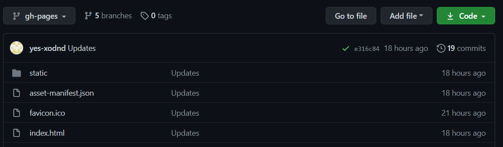
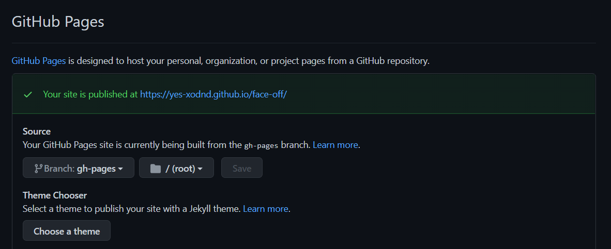

# 2021.02.23 CRA로 생성한 프로젝트 깃헙 페이지로 배포하기

깃헙 페이지는 저장소를 베이스으로 정적 페이지를 배포할 수 있는 기능입니다. 이전에 수행했던 프로젝트의 프론트엔드 코드를 정적 페이지로 전환하여 배포해보면서, 배포 과정 및 문제 해결 과정을 공유하고자 합니다. 

### 1. 프로젝트 및 깃헙 저장소 생성

- 이미 존재하는 프로젝트를 배포했지만, 처음부터 시작한다고 가정겠습니다.

- `create-react-app`을 통해 프로젝트를 생성하고, 깃헙에서도 저장소를 생성해줍니다.

- 프로젝트 폴더와 저장소를 연결해줍니다.

  ``` bash
  git init
  git remote add origin https://github.com/[username]/[reponame].git
  ```

### 2. gh-pages모듈 설치

- `npm`으로 깃헙 페이지 배포를 도와주는 Node.js 모듈 `gh-pages`를 설치해줍니다.

- `--save-dev` 옵션으로 package.json 파일의 `devDependencies`에 추가되고, 프로덕션 빌드에는 포함되지 않도록 합니다.

  ``` bash
  npm install gh-pages --save-dev
  ```

### 3. package.json 파일 수정

- 프로젝트 폴더의 package.json 파일에서 `homepage` 속성에 프로젝트가 배포될 깃헙 페이지 주소를 작성해줍니다.

  ``` json
  // package.json
  {
      "homepage": "[username].github.io/[reponame]",
      "name": 'project',
      // ...
  }
  ```

- 추가로 `scripts` 속성에 `predeploy`와 `deploy` 속성을 다음과 같이 작성해줍니다.

  ``` json
  // package.json
  {
      // ...
      "scripts": {
          // ...
          "predeploy": "npm run build",
          "deploy": "gh-pages -d build"
  	},
  }
  ```


### 4. 배포하기

- 방금 등록한 `deploy` 명령어를 이용해 빌드하고, 빌드파일을 원격 저장소에 푸시합니다.

  ``` bash
  npm run deploy
  ```

- 실행 완료 후 깃헙 저장소에 들어가면 `gh-pages` 브랜치가 생성되어 빌드 파일이 업로드 된 것을 확인할 수 있습니다.

  

- 깃헙의 Settings에서 Github Pages의 Source브랜치를 gh-pages로 변경하고, 상단의 배포 메세지를 확인하면 배포가 완료됩니다. 이제 링크를 통해 들어가서 배포된 사이트를 확인할 수 있습니다.

  


### 5. 리소스 로드 문제

- 저장소 이름을 `[username].github.io`로 한 경우에는 문제가 없지만, 별도의 저장소 이름을 지정한 경우에는 HTTP 404 not found오류와 함께 css, js 등의 리소스 파일을 로드하는 데 문제가 발생합니다.

- 문제는 `[username].github.io/[reponame]/static` 에 요청해야 할 리소스를 `[username].github.io/static`에서 요청하는 것입니다.

- 이는 React Router는 슬래시(/)가 나오기 전까지의 주소를 기준으로 주소를 변경하기 때문에 발생하는 문제입니다. 따라서 항상 기준 주소에  `[reponame]`을 추가해 요청할 수 있도록 변경해 해결할 수 있습니다.

  ``` jsx
  // App.js
  
  function App() {
      <BrowserRouter basename="/[reponame]">
          <Component></Component>
      </BrowserRouter>
  }
  ```

  > [리액트 라우터 공식문서](https://reactrouter.com/web/api/BrowserRouter)
  >
  > [Stackoverflow - React: clientside routing with react-router on gh pages](https://stackoverflow.com/questions/52024667/react-client-side-routing-with-react-router-on-gh-pages)