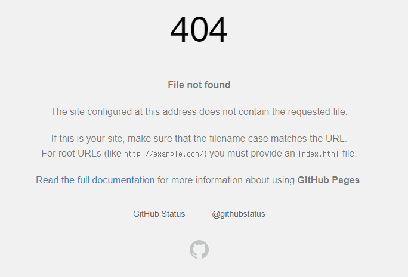

# SPA Github Page

### 1. 문제

- spa를 gh-page를 이용해 배포한 후 배포 페이지에서 새로고침을 누를 경우 에러가 발생합니다.

  root url의 경우 아무런 문제가 없지만 root가 아닌 경우 아래의 결과를 확인하게 됩니다.

### 2. 원인

- gh-page의 경우 spa를 지원하지 않습니다.
- `example.tld/foo` 의 요청이 들어온 경우 `/foo` 가 프론트엔드 경로인 경우 gh-page 서버는 이 경로에 아무것도 없기 때문에 404 error를 반환하게 됩니다.

### 3. 해결 방법

- 404 에러시 보여지는 404.html 커스텀하여 리다이렉션을 합니다.

- 리다이렉션 코드와 상세한 방법은 링크를 참조하시면 됩니다.

  [사용 방법]: https://github.com/rafgraph/spa-github-pages#usage-instructions

### 4. 문제점

- 상태가 보존되지 않는 문제가 있습니다.
- 2019년 구글의 알고리즘이 변경되며 리다이렉션이 되어 들어오는 링크는 실제 경로와 연결되지 않아 사이트의 랭킹에 영향을 주지 못합니다.
  (페이지의 랭킹이 중요한 경우 Gatsby 나 Netlify 를 권장)

### 5. 참고자료

- https://github.com/rafgraph/spa-github-pages